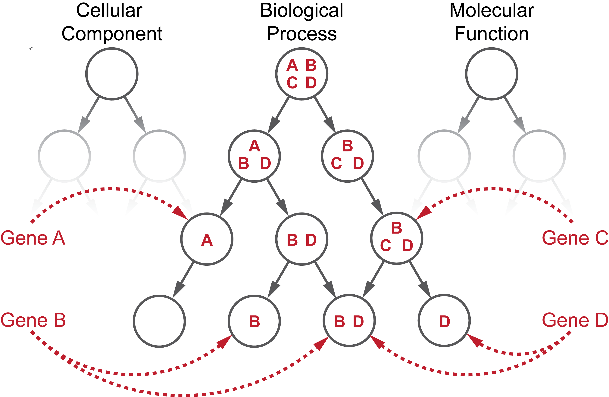

# Welcome!

This is the documentation webpage for AEGIS ((Augmented Exploration of the GO with Interactive Simulations). AEGIS is an open-source software with an interactive information-retrieval framework that enables an investigator to navigate through the entire Gene Ontology (GO) graph (with tens of thousands of nodes) and focus on fine-grained details without losing the context. It features interpretable visualization of GO terms reported from studies, flexible exploratory analysis of the GO DAG, as well as principled power analysis that is biologically relevant.

---

## Getting Started

Accompanied with our
[user manual](./manual) and
[video tutorials](./tutorial),
there are two options to explore the visualization by AEGIS:
the lite version and the full version.

### The lite version

A light weight version of AEGIS is available as a web interface [here](https://aegis-viz.appspot.com/). It includes the minimal interactive features with some examples for simple demonstrations. The lite version does not require installation and serves as an introduction to our visualization concepts.

### The full version

The full version includes all features, including data upload and power analysis functions. This version is meant to be [installed](./install) locally and include more customization and computationally intensive processes. The code is [open source]() with [api documentation](./api) so advanced pipelines can customize it to their needs.

---

## Behind the Name

According to [Greek Mythology](http://greekmythology.wikia.com/wiki/Aegis), Perseus used Athena’s shield to look at Medusa's reflection without being petrified.
This shield that empowered Perseus to defeat Medusa later became the AEGIS.
To see the object of interest in a way that is manageable and informative, one cannot directly “look at it,” but appropriate visualization tools are needed.

The [modern concept](https://en.wikipedia.org/wiki/Aegis) of doing something
"under someone's aegis" means doing something under the protection of a powerful,
knowledgeable, or benevolent source. By combining visualization with the rich knowledge in the Gene Ontology, we hope to offer scientists a new tool to discover hidden patterns and uncover the gems in their data.

    
      <b>Minerve remettant à Persée son bouclier avec lequel il doit combattre La Méduse </b>
       
      by Houasse René Antoine
      (<a href="https://en.muzeo.com/art-print/minerve-remettant-a-persee-son-bouclier-avec-lequel-il-doit-combattre-la-meduse/houasse">Image Source</a>)

---

## The Gene Ontology

The Gene Ontology (GO) is one of the most popular biological databases. It consists of two continuously evolving elements: (1) a collection of controlled biological terms with semantic hierarchical relationships and (2) annotations that link genes and gene products to specific terms.

The GO can be represented as a graph where each node represents a GO term, and each directed link pointing from a parent to a child represents the semantic relationship with two terms. The child term can be related to the parent term via an “is a”, “part of” or “regulates” relation. There are three root nodes: “biological process”, “molecular function” and “cellular component”, and each of their descendants are connected with directed edges in an acyclic fashion. Genes can be simultaneously annotated to different terms, and their annotations propagate upwards in the hierarchy, resulting in the gene sets in the nodes.

For more detailed information about the GO, please visit
[the GO Consortium](http://geneontology.org/page/introduction-go-resource)
and
[the GO Handbook](http://gohandbook.org/doku.php).

    

---

## Contact Us

AEGIS is developed and maintained by
[Junjie (Jason) Zhu]("http://jasonjunjiezhu.com/")
in the
[Sabatti Lab](http://statweb.stanford.edu/~sabatti/)
at
[Stanford University](https://www.stanford.edu/).
Both
[Qian Zhao](https://stanfordwho.stanford.edu/SWApp/detailAction.do?key=DR337X062%20%20%20%20%20%20%20&search=Zhao&soundex=&stanfordonly=&affilfilter=everyone&filters=)
and
[Eugene Katsevich](http://web.stanford.edu/~ekatsevi/)
have also contributed to the development of this project.
You can find the contact information at the webpages or via Github issues.

---

## How to Cite

Our manuscript is currently under review and instructions will be available soon.
