## Visualization Panel and Options

### Full and Lite Versions

There are two options to explore the visualization by AEGIS:
the lite version and the full version.

The full version includes all features, including data upload and power analysis functions.

    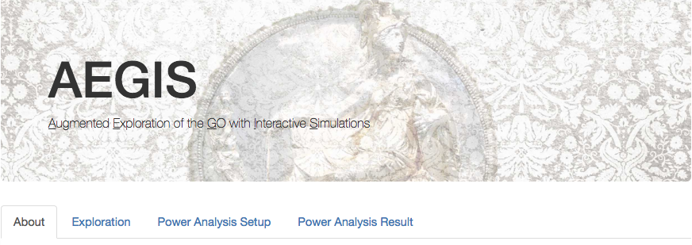

A light weight version includes the minimal interactive features with some examples for simple demonstrations.

    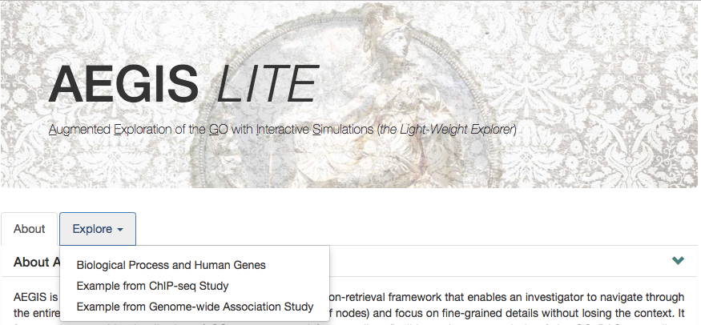

### Main Graphical Interface

The following is the common graphical interface used in AEGIS. It consists
several panels.

    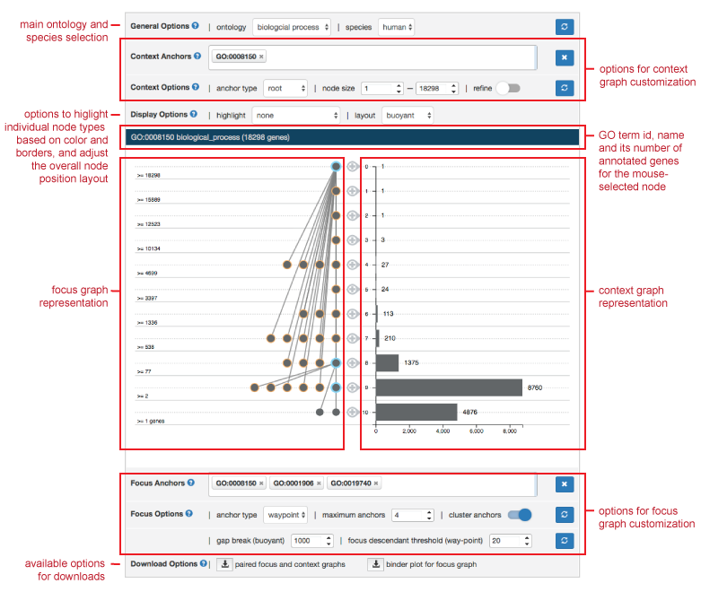

!!! note
    In the lite version the context selection is disabled for performance reasons. You will need to [install](../install) the full version to flexibly select the context. Further, the "Download Options" can vary based on which application of AEGIS a user chooses.

Next, we will elaborate on what some of the terminologies mean and how to update the focus and context graphs using our options.

### Terminology and Concepts

AEGIS also introduces some new concepts that facilitate interpretation and interactions.

#### Focus graph, context graphs and their anchors

AEGIS visualizes the GO graph based on the idea of a context and a focus graph.
The following figure illustrates this concept, you can also find detailed explanation
in our [video demos](../tutorial).

    

In a GO DAG, each node represents a GO term and each link represents a parent child relationship.
The context graph (highlighted with red nodes above) is sub-DAG of the full DAG,
based on context anchors (with pink borders).
The focus graph (highlighted with blue nodes above) is a sub-DAG of the context graph.
It is similarly selected based on focus anchors (with aqua borders).

The context and focus anchors can be of three types: waypoint, root or leaf.
If an anchor is a waypoint anchor, all of its ancestors and descendants will be included;
if an anchor is a root anchor, only its descendants will be included;
if an anchor is a leaf anchor, only its parents will be included.
For our visualization (on the right), the context graph is represented via a silhouette view,
only indicating the number of nodes in each level.
The focus graph is represented as a bone fide graph with detailed links and nodes.

#### Root-bound, leaf-bound and buoyant layouts

    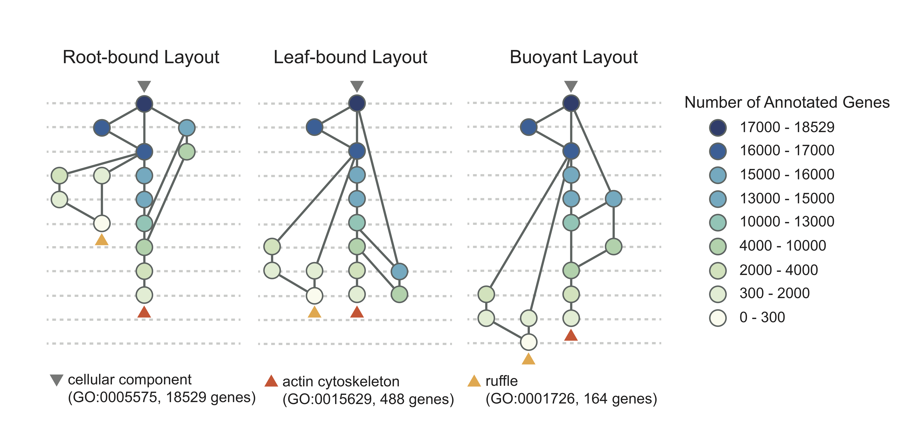

The root-bound layout places each node at levels based on their longest distance to the root; the leaf-bound layout places them based on their longest distance to the leaves. Both of these options preserve a topological constraint where each parent node is higher than its children, and minimizes the number of levels in the DAG.

The buoyant layout preserves not only the topological constraint, but also factors in the gene annotations, such that a node with fewer annotated genes is placed no higher than that with more genes. The buoyant layout is powered by our bubble-float algorithm. The leaf bound layout places each node at levels based on their longest distance to any of the leaves.

#### Refinement of context

If the "refine" option is selected for the context graph, then our internal
algorithm will filter out nodes that have at least one child that shares the
exact gene annotations. One advantage of this approach is to reduce the number
of repetitive hypotheses during hypotheses testing and multiplicity correction.

#### Prolific node and focus descendant threshold

A GO term is a prolific node if the number of its children exceeds a threshold.
We refer to the threshold as the "focus descendant threshold". For all the non-anchor
nodes in the focus graph, we hide all the children (and possible descendants) if they
are classified as prolific nodes. This feature aims to limit the display from being overcrowded.
Note that the focus descendant threshold is adjustable.

#### Outer focus anchors

The outer focus anchors are the least redundant concepts among the selected
focus anchors. In other words, if a focus anchor is not an outer focus anchor,
then it must have at least one descendant that is a focus anchor -
removing this node typically does not change the focus graph display.

#### Clustered anchors

For the focus graph, you have the option to group nodes based on the focus
anchors such that it is easier to see the grouping structure among the nodes.
The grouping is based on our customized topological sorting algorithm.

    

#### Gap break

For the buoyant layout specifically, the gap break is the maximum tolerance for
the number of annotations between two consecutive nodes in the same level.
It is recommended to use a larger gap break when there are fewer nodes,
and smaller when there are more nodes.

#### Binder plot for focus graph

For the buoyant layout specifically, the binder plot constructs a linear representation
of the nodes for the focus graph. The edges follow the Sugiyama-style graph drawing rules.

    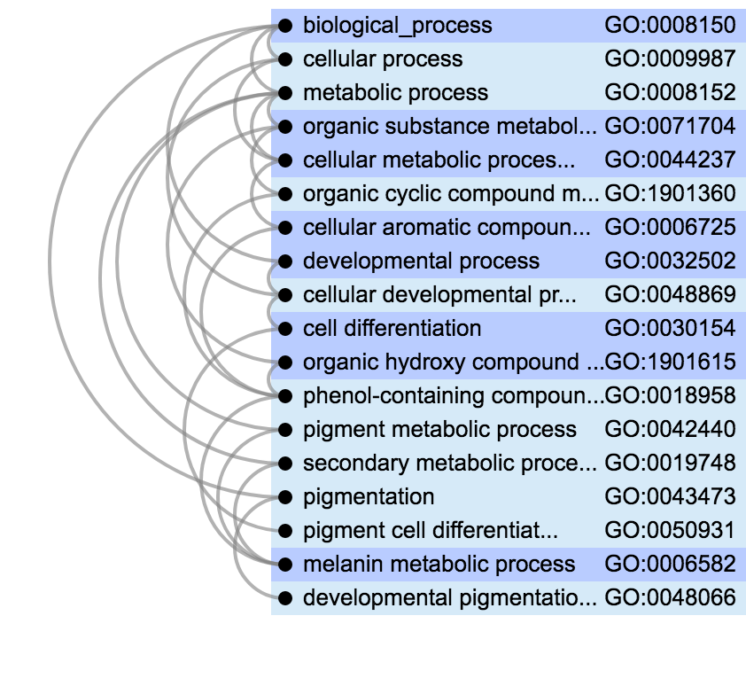

### Navigation Features

A user can specify the focus and context graph to visualize within the “focus-and-context navigation” tab. He/she can set parameters to modify the graph display (see “further visualization adjustment”), and interactively explore the GO DAG.

#### Select Ontology

Select ontology in drop-down menus in “General Options” tab. AEGIS currently incorporates human and mouse ontology of biological process, cellular components, and molecular function. All relationships (e.g., “is a”, “part of”, “has part”, or “regulates”) for the GO terms were used for the cellular component ontology, but only “is a” relationships were kept for the biological process ontology.

#### Select Context and Focus Anchors

To add a context anchor, type the GO term name (e.g. biological_process) or GO ID (e.g. GO: 0008150) into the search box next to “Context Anchors” tab. GO term names can be autocompleted. After selecting context anchors and context options, click refresh button to update context graph.

There are three ways to add focus anchors in AEGIS: (1) type in GO term name or GO ID into the search box next to “Focus Anchors” tab (2) Double click a node in focus graph (3) Double click leveled “+” sign next to context graph.

#### Context Graph Options

The context anchors can be either waypoint anchors or root anchors. If the context anchors are waypoint anchors, the context graph includes all their descendents and ancestors. If they are root anchors, the context graph will include only their descendents (see “visualization concept”). Select context anchor types in “anchor type” drop down menu.

The context graph can be filtered to include only GO terms whose node sizes fall in a particular range. Specify a range of node sizes in the “node size” tab, click refresh button, the context graph will only include GO terms that are within this range.

The context graph can be refined by clicking the refine button. If the user selects the refined context graph, all nodes that shares the same gene sets as their children will be removed, their edges will be redirected to nodes that inherits their gene sets.

The focus anchors can be either waypoint anchors or leaf anchors. If the focus anchors are waypoint anchors, the focus graph includes all their descendents and ancestors. If they are leaf anchors, the focus graph will include only their parents. (see “visualization concept”, “context graph options”). Select anchor type in corresponding drop-down menu.

Set “Maximum anchor” to adjust maximum number of focus anchors that can be included in the focus graph. If current number of focus anchors is 4 and maximum anchor is set to be 4, adding another focus anchor will force the first focus anchor to be removed.

#### Layout Options

After selecting anchors, the user can choose graphical layout for the focus graph in the layout option drop-down menu. (see “visualization concept: buoyant layout”)

#### Interaction on the Focus Graph

Figure above shows the initial graph display from AEGIS. On the left is the focus graph, nodes are placed at levels according to specified layout option (see “layout option”). Focus anchors are circled in aqua. Level node counts are shown at left the of focus graph. On the right is the context graph which is a bar chart of level node counts in the context graph.

Hover mouse over a node to view the GO term information in the information board above.
It also highlights relatives of the node, parents and children in dark red and others in red.

Drag and drop a node to adjust its position.

Double click a node to add it to focus anchors.
If the node is a prolific node [visualization concept], double clicking will also display its children.

Double click leveled “+” sign next to the context graph draws a random node in the context graph to be focus anchor.

## Gene Set Selection

In addition to exploring the GO DAG, a user can use focus and context visualization in AEGIS to identify gene sets that might be usefully for applications such as differential gene expression analysis and single cell benchmarking. One main application of this function is for our built-in [power analysis workflow](#power-analysis-and-simulation). Select gene sets in the gene selection box [need a figure here], selected genes can be easily exported, or used as input signal genes for subsequent power simulation. This section is adapted from video demo, where you can find more examples.

#### Searching for Genes

A user can directly search for the gene symbol (or ensembl ID) in the "Gene Selection" input box. Gene names can be auto-completed.

    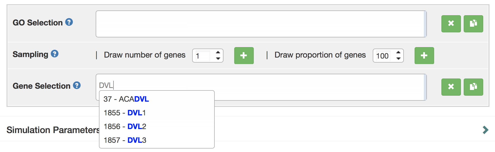

    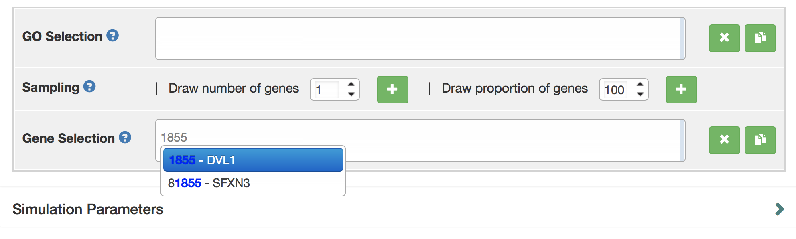

If you have little knowledge about gene names, the user can rely on the GO terms to select sets. They can select a number of GO terms by typing their names in the “GO selection” box to select GO terms. In this example, the GO term of interest “adult heart development”. To select “adult heart development”, type GO term name (“adult heart development”), or GO ID (“GO: 0007512”) into the search box. There is also auto-complete for the GO term name. Next, you can use the options below to randomly sample a number or a proportion of genes annotated with this GO term.

    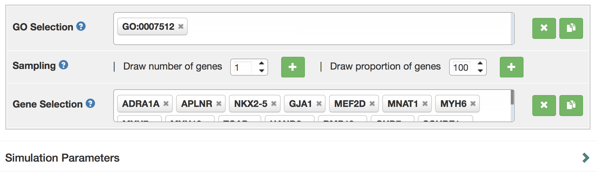

#### Clearing and Copying

A user can clear selected GO terms or selected genes individually or all at once. Click cross sign next to gene selection box to clear all terms. Click cross sign next to individual term to clear individual term. Click the clipboard sign to copy selected GO terms / genes to clipboard.

    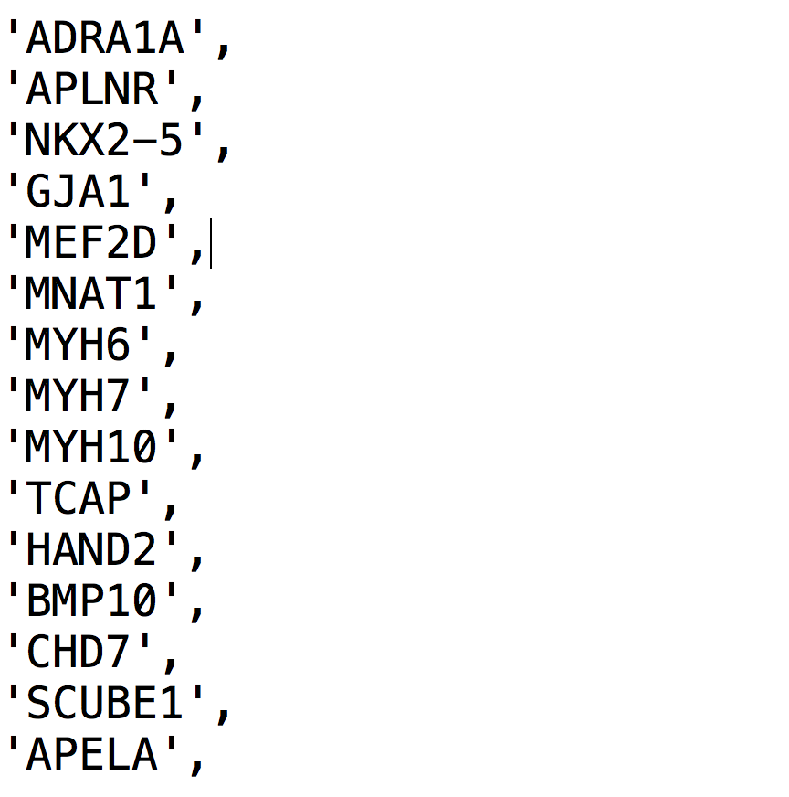

#### Real-time update of self-contained and competitive nulls

For power analysis specifically, once a user specify differentially expressed genes, they can highlight self-contained and competitive non-null terms within the current context graph in “highlight” options. Specifically, a GO term is a self-contained null if none of the genes annotated to it is differentially expressed. It is a competitive null if proportion of differentially expressed genes is less than that of the entire genome. For instance, the root node, “animal organ development” is a self-contained non-null, but it is not a competitive non-null.

    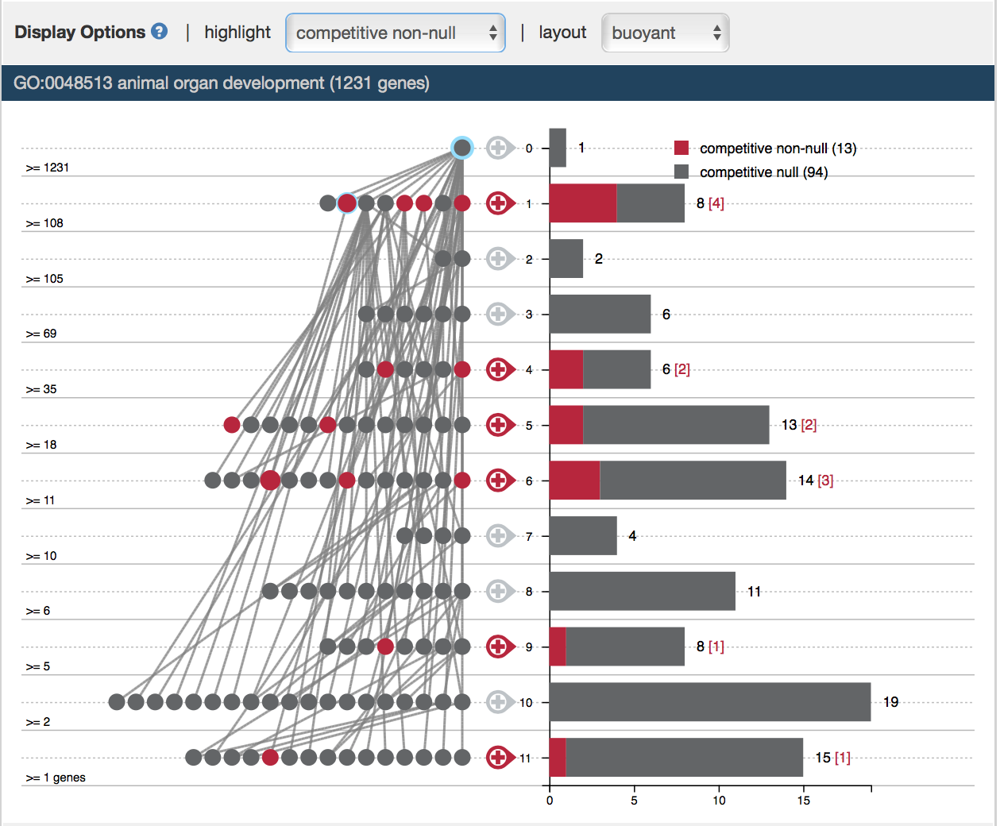

    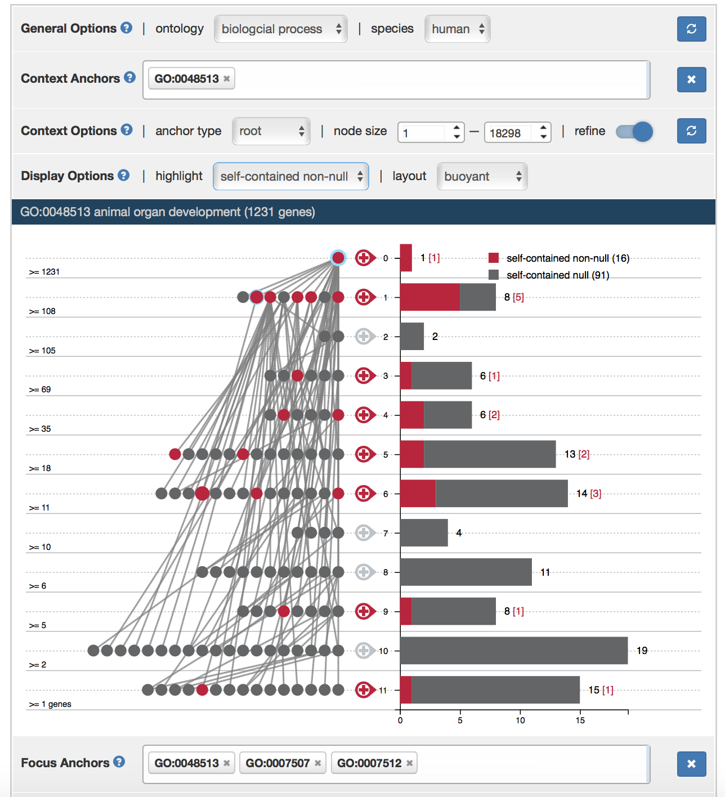

## GO Term Data Input

As a convenient way to specify context or focus anchors, a user can upload GO terms in the “Data upload” section. The user can upload either focus or context anchors or both. When only focus anchors are specified, the context anchors will be initialized as the ontology roots. When only context anchors are specified, the focus anchors will be randomly initialized. When both are specified, only valid focus anchors within the specified context graph will be used.

!!! note
    Currently, this data input functionality is only supported locally in the full version of AEGIS (which requires a simple [installation](../install)), and not in the lite version on the web server.

    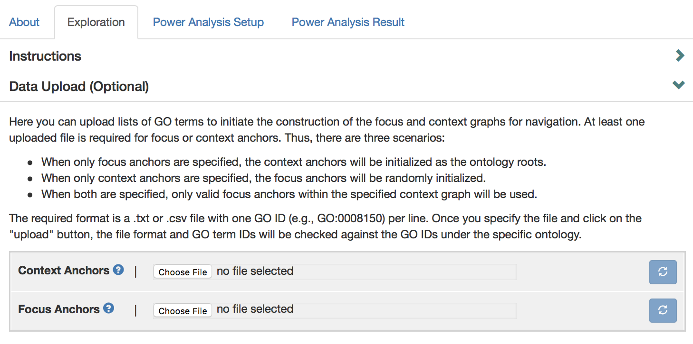

To upload a GO term file, click “Data Upload” to expand data upload box.

Click “Choose File” button to upload GO terms. The required format is a .txt or .csv file, with one GO ID (e.g., GO: 0008150) per line. An example file that can be found at “aegis/data/great_srf_example.txt”, which is uploaded as context anchors here. After file selection, click on refresh button, a green arrow appears if GO term file has been uploaded successfully.

    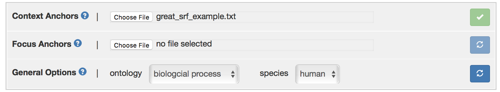

After uploading GO terms, the user need to choose the ontology and species in in “General Options” panel. For this example, “human cellular component” ontology is selected. Click refresh button after selecting desired ontology, a green arrow should appear if ontology is specified correctly. All the uploaded GO terms will appear in the box below. Otherwise, error message “None of the context anchors were identified in the current ontology. Perhaps the wrong ontology was selected” will appear.

    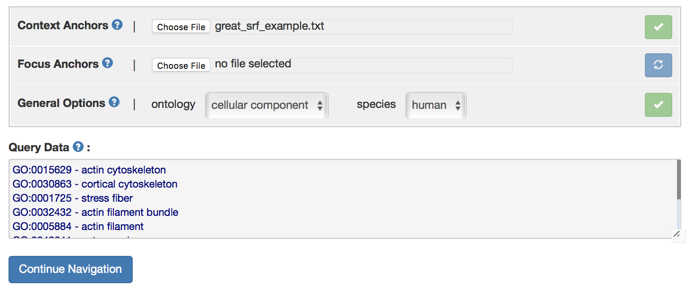

Click “Continue Navigation” button to expand focus and context graphs.  If no data is uploaded, click “focus-and-context anchor navigation” to start GO exploration.

## Power Analysis and Simulation

A user can perform power simulation for potential study design in the full version of AEGIS.
Detailed explanation of power analysis workflow can be found in Section 5.1 in our manuscript. Here is an over view of the system.

    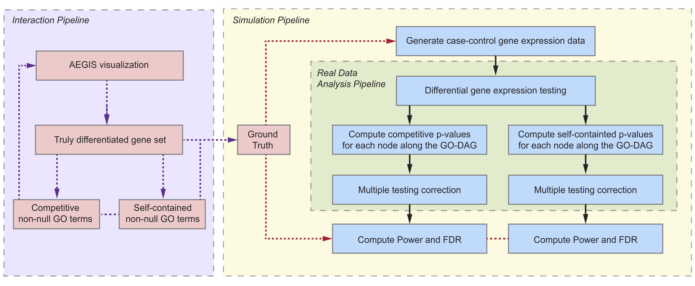

To enter the simulation and power analysis workflow, go to “Power analysis setup” tab within the main panel.

    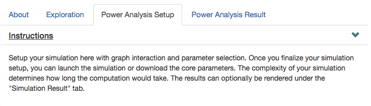

!!! note
    Currently, this power analysis functionality is only supported locally in the full version of AEGIS (which requires a simple [installation](../install)), and not in the lite version on the web server.

#### Selecting the Testing Context

First, the user needs to select the testing context. The number of nodes to test is conveniently defined by the context graph. Thus, we also recommend a user to turn on the option to refine the graph to remove redundant identical tests. By default, the context is the entire ontology with refined nodes.

    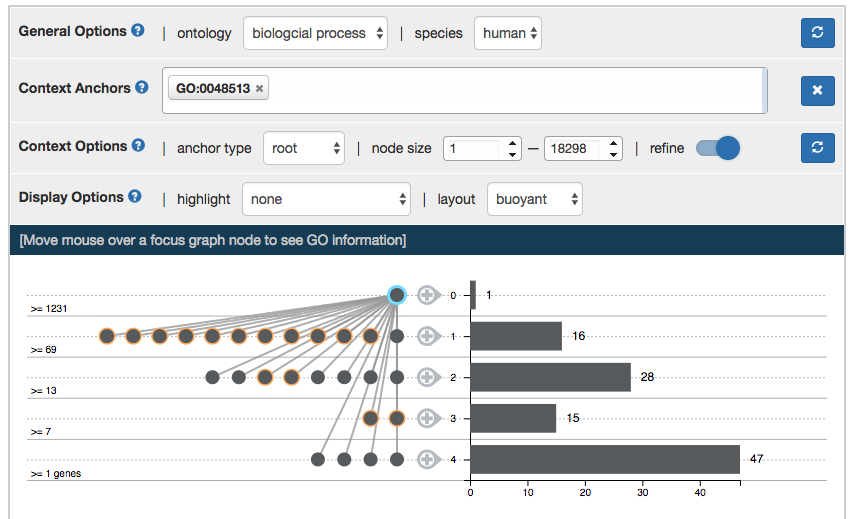

#### Selecting Differentially Expressed Genes

Core to the simulation is to select gene sets. A user needs to select truly differentially expressed genes $\{g_1, … ,g_m\}$ (see [Gene Set Selection](#gene-set-selection)).

Once a user selects truly differentially expressed genes, AEGIS generates gene expression data $X$ for case and control samples from the following multivariate normal model:
$$
X \sim \mathcal{N}(0, I)
$$
if $X$ is a control sample, and
$$
X \sim \mathcal{N}(\mu, I)
$$
if $X$ is a case sample. Here $\mu$ corresponds to a vector which is equal to $\beta_{effect}$ at the selected differentially expressed genes
$\{g_1, … ,g_m\}$  and 0 otherwise.

!!! note
    The dimension of $X$ is the number of samples times the number of genes. The number of samples is a user-specified quantity, and the number of genes is determined based on the testing context: only genes annotated to the root nodes of the context graph are used.

#### Specifying Simulation Parameters

Beyond the gene set, many parameters can be selected. To set simulation parameters, click “Simulation Parameters” to expand simulation options.

    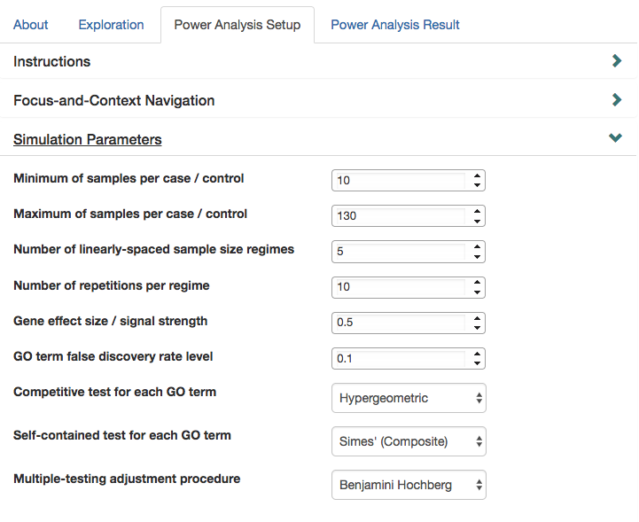

Use “Gene effect size/signal strength” to set $\beta_{effect}$. Use “Minimum of samples per case / control”, “Maximum of samples per case / control” and “Number of linearly spaced sample size regimes” to set number of case and control samples. For instance, if “min samples” is 10, “max samples” is 50, and “num linearly spaced samples” is 10, then sample sizes {10, 20, 30, 40, 50 will be used in the simulation. A user can repeat simulation multiple times for each sample size, default value of “Number of repetitions per regime” is 10 per sample size. A user can further use “Multiple testing adjustment procedure” to select Bonferroni / BH method to adjust for multiple hypothesis testing. He/she can set desired FDR level in “GO term false discovery rate level”.

#### Launching the Simulation

Finally, to launch the simulation, you will generate a unique job ID. Make sure to store this job ID as it will be used for retrieving the finalized output.

    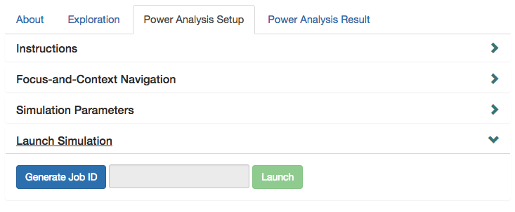

#### Retrieving Simulation Results

Once the simulation is complete, a user can use our interface to visualize the summary statistics and out customized renderings. The simulation-specific job ID is required to retrieve these results.

    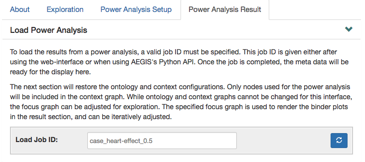

Successfully loaded simulations should render the context graph that was used for testing, with focus nodes anchored on the (self-contained) non-null GO terms.

    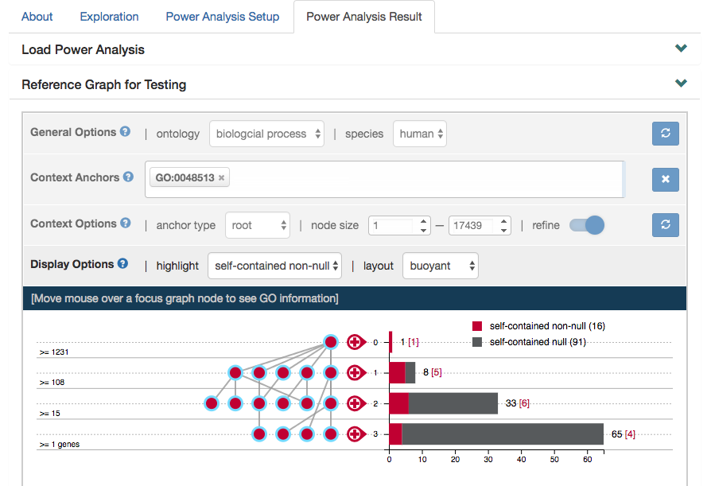

Following the graph, the next panel on "Power Analysis Result" displays all the parameters used for the simulation and the summary statistics including false discovery rate (FDR), power and number of rejected GO terms.

    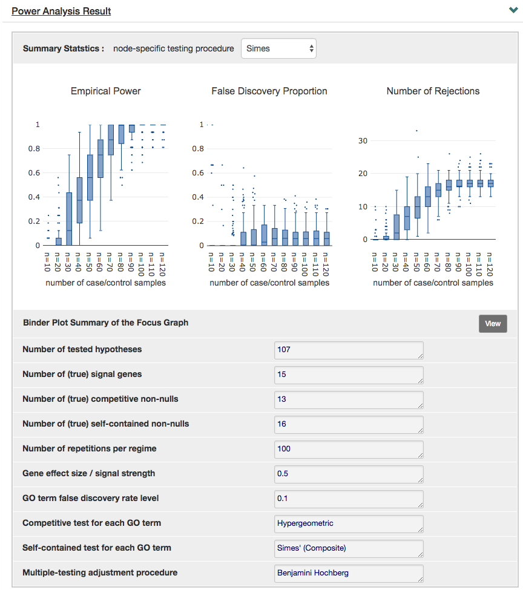

As one of our highlighted features, you can also visualize the node-specific power of nodes specified in the focus graph via binder plots by clicking "View" next to the "Binder Plot Summary of the Focus Graph". Again, this can be adjusted in the previous panel "Reference Graph for Testing".

    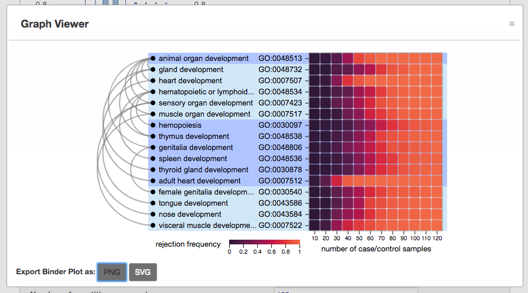

